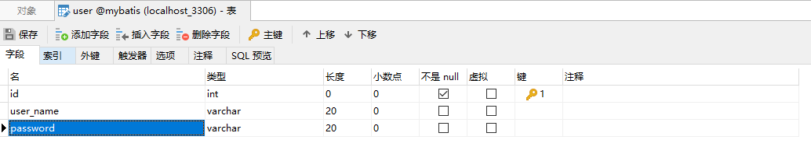
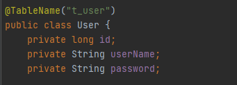
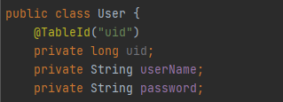
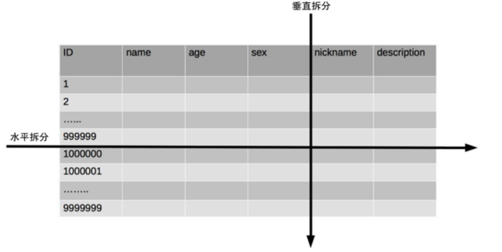
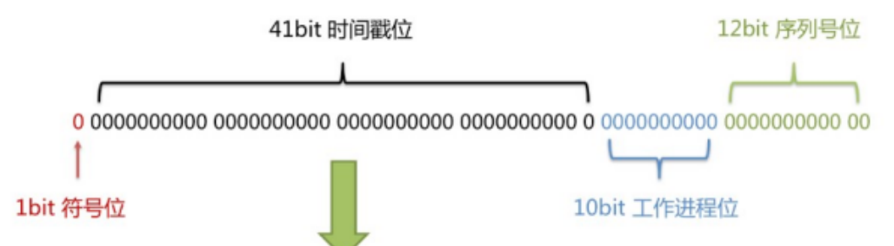
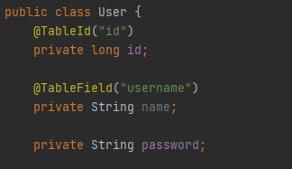
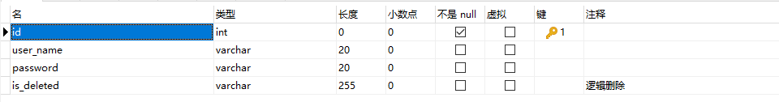
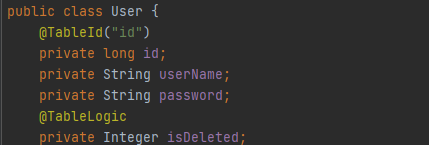
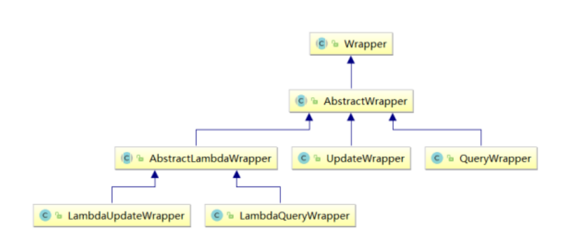

# MyBatis-Plus学习笔记

## 声明

本笔记源于尚硅谷的教程再加上自己的总结，如果有不明白的地方需要参考原教程[MyBatisPlus教程](https://www.bilibili.com/video/BV12R4y157Be)


## 一、简介

MyBatis-Plus（简称 MP）是一个 MyBatis的增强工具，在 MyBatis 的基础上只做增强不做改变，为
简化开发、提高效率而生。

### 特性
1) 无侵入：只做增强不做改变，引入它不会对现有工程产生影响，如丝般顺滑
1) 损耗小：启动即会自动注入基本 CURD，性能基本无损耗，直接面向对象操作
1) 强大的 CRUD 操作：内置通用 Mapper、通用 Service，仅仅通过少量配置即可实现单表大部分
1) CRUD 操作，更有强大的条件构造器，满足各类使用需求
1) 支持 Lambda 形式调用：通过 Lambda 表达式，方便的编写各类查询条件，无需再担心字段写错
1) 支持主键自动生成：支持多达 4 种主键策略（内含分布式唯一 ID 生成器 - Sequence），可自由
 配置，完美解决主键问题
1) 支持 ActiveRecord 模式：支持 ActiveRecord 形式调用，实体类只需继承 Model 类即可进行强
 大的 CRUD 操作
1) 支持自定义全局通用操作：支持全局通用方法注入（ Write once, use anywhere ）
1) 内置代码生成器：采用代码或者 Maven 插件可快速生成 Mapper 、 Model 、 Service 、
Controller 层代码，支持模板引擎，更有超多自定义配置等您来使用
1) 内置分页插件：基于 MyBatis 物理分页，开发者无需关心具体操作，配置好插件之后，写分页等
 同于普通 List 查询
1) 分页插件支持多种数据库：支持 MySQL、MariaDB、Oracle、DB2、H2、HSQL、SQLite、
Postgre、SQLServer 等多种数据库
1) 内置性能分析插件：可输出 SQL 语句以及其执行时间，建议开发测试时启用该功能，能快速揪出
慢查询

### 代码及文档地址

官方地址:http://mp.baomidou.com

代码发布地址:

Github: https://github.com/baomidou/mybatis-plus

Gitee: https://gitee.com/baomidou/mybatis-plus

文档发布地址:

https://baomidou.com/pages/24112f


## 二、搭建环境

### 1. 创建表


### 2. 创建maven工程，pom.xml内容如下

```
<?xml version="1.0" encoding="UTF-8"?>
<project xmlns="http://maven.apache.org/POM/4.0.0"
         xmlns:xsi="http://www.w3.org/2001/XMLSchema-instance"
         xsi:schemaLocation="http://maven.apache.org/POM/4.0.0 http://maven.apache.org/xsd/maven-4.0.0.xsd">
    <modelVersion>4.0.0</modelVersion>

    <groupId>org.example</groupId>
    <artifactId>MyBatisPlus</artifactId>
    <version>1.0-SNAPSHOT</version>

    <properties>
        <maven.compiler.source>14</maven.compiler.source>
        <maven.compiler.target>14</maven.compiler.target>
        <spring.version>5.3.1</spring.version>
    </properties>
    <packaging>jar</packaging>
    <dependencies>
        <dependency>
            <groupId>org.springframework</groupId>
            <artifactId>spring-context</artifactId>
            <version>5.3.1</version>
        </dependency>
        <dependency>
            <groupId>org.springframework</groupId>
            <artifactId>spring-jdbc</artifactId>
            <version>5.3.10</version>
        </dependency>
        <dependency>
            <groupId>org.springframework</groupId>
            <artifactId>spring-test</artifactId>
            <version>5.3.10</version>
        </dependency>
        <!-- 连接池 -->
        <dependency>
            <groupId>com.alibaba</groupId>
            <artifactId>druid</artifactId>
            <version>1.1.13</version>
        </dependency>
        <!-- junit测试 -->
        <dependency>
            <groupId>junit</groupId>
            <artifactId>junit</artifactId>
            <version>4.12</version>
            <scope>test</scope>
        </dependency>
        <!-- MySQL驱动 -->
        <dependency>
            <groupId>mysql</groupId>
            <artifactId>mysql-connector-java</artifactId>
            <version>8.0.16</version>
        </dependency>
        <!-- 日志 -->
        <dependency>
            <groupId>org.slf4j</groupId>
            <artifactId>slf4j-api</artifactId>
            <version>1.7.30</version>
        </dependency>
        <dependency>
            <groupId>ch.qos.logback</groupId>
            <artifactId>logback-classic</artifactId>
            <version>1.2.3</version>
        </dependency>
        <!-- lombok用来简化实体类 -->
        <dependency>
            <groupId>org.projectlombok</groupId>
            <artifactId>lombok</artifactId>
            <version>1.18.20</version>
            <scope>provided</scope>
        </dependency>

        <!--MyBatis-Plus的核心依赖-->
        <dependency>
            <groupId>com.baomidou</groupId>
            <artifactId>mybatis-plus</artifactId>
            <version>3.4.3.4</version>
        </dependency>
    </dependencies>
</project>
```

在以上的依赖列表中，并没有MyBatis以及Spring整合MyBatis的依赖，因为当我们引入了
MyBatis-Plus的依赖时，就可以间接的引入这些依赖

## 三、 Spring整合MyBatis

###  1.创建POJO实体

```
package com.CloudHu.MyBatisPlus.POJO;

public class User {
    private long id;
    private String userName;
    private String password;

    public User() {
    }

    public User(long id, String userName, String password) {
        this.id = id;
        this.userName = userName;
        this.password = password;
    }

    public long getId() {
        return id;
    }

    public void setId(long id) {
        this.id = id;
    }

    public String getUserName() {
        return userName;
    }

    public void setUserName(String userName) {
        this.userName = userName;
    }

    public String getPassword() {
        return password;
    }

    public void setPassword(String password) {
        this.password = password;
    }

    @Override
    public String toString() {
        return "User{" +
                "id=" + id +
                ", userName='" + userName + '\'' +
                ", password='" + password + '\'' +
                '}';
    }
}

```

### 2.创建MyBatis的核心配置文件

在resources下创建mybatis-config.xml

```
<?xml version="1.0" encoding="UTF-8" ?>
<!DOCTYPE configuration PUBLIC "-//mybatis.org//DTD Config 3.0//EN"
        "http://mybatis.org/dtd/mybatis-3-config.dtd">
<configuration>

</configuration>
```

### 3.创建mapper接口和映射文件

mapper接口

```
public interface UserMapper {
    List<User> getAllUser();
}
```

mapper映射文件：

在resources下的com/CloudHu/MyBatisPlus/Mapper目录下创建UserMapper.xml

```
<?xml version="1.0" encoding="UTF-8" ?>
<!DOCTYPE mapper PUBLIC "-//mybatis.org//DTD Mapper 3.0//EN"
        "http://mybatis.org/dtd/mybatis-3-mapper.dtd">

<mapper namespace="com.CloudHu.MyBatisPlus.Mapper.UserMapper">
    <!--  List<User> getAllUser();  -->
    <select id="getAllUser" resultType="com.CloudHu.MyBatisPlus.POJO.User">
        select * from t_user
    </select>

    <!--int insertUser(User user);-->
    <insert id="insertUser">
        insert into t_user
        values (null, #{userName}, #{password})
    </insert>

</mapper>
```

### 4.创建jdbc.properties

在resources下创建jdbc.properties

```
jdbc.driver=com.mysql.cj.jdbc.Driver
jdbc.url=jdbc:mysql://localhost:3306/mybatis?useUnicode=true&useJDBCCompliantTimezoneShift=true&useLegacyDatetimeCode=false&serverTimezone=UTC
jdbc.username=root
jdbc.password=zxcvbnm,./123
```


```
<?xml version="1.0" encoding="UTF-8"?>
<beans xmlns="http://www.springframework.org/schema/beans" xmlns:xsi="http://www.w3.org/2001/XMLSchema-instance"
       xmlns:context="http://www.springframework.org/schema/context"
       xsi:schemaLocation="http://www.springframework.org/schema/beans http://www.springframework.org/schema/beans/spring-beans.xsd http://www.springframework.org/schema/context https://www.springframework.org/schema/context/spring-context.xsd">
    <!-- 引入jdbc.properties -->
    <context:property-placeholder
            location="classpath:jdbc.properties"></context:property-placeholder>

    <!-- 添加扫描组件的配置，扫描业务层组件 -->
    <context:component-scan
            base-package="com.CloudHu.MyBatisPlus.Service.Impl"></context:component-scan>


    <!-- 配置用于创建SqlSessionFactory的工厂bean -->
    <bean class="org.mybatis.spring.SqlSessionFactoryBean"> 
        <!-- 设置MyBatis配置文件的路径（可以不设置） -->
        <property name="configLocation" value="classpath:mybatis-config.xml"></property> 
        <!-- 设置数据源 -->
        <property name="dataSource" ref="dataSource"></property> 
        <!-- 设置类型别名所对应的包 -->
        <property name="typeAliasesPackage"
                  value="com.atguigu.mp.pojo"></property> <!--设置映射文件的路径 若映射文件所在路径和mapper接口所在路径一致，则不需要设置 --> 
        <!--<property name="mapperLocations" value="classpath:mapper/*.xml"> </property> -->
    </bean>

    <!-- 配置Druid数据源 -->
    <bean id="dataSource" class="com.alibaba.druid.pool.DruidDataSource">
        <property name="driverClassName" value="${jdbc.driver}"></property>
        <property name="url" value="${jdbc.url}"></property>
        <property name="username" value="${jdbc.username}"></property>
        <property name="password" value="${jdbc.password}"></property>
    </bean>

    <!--配置mapper接口的扫描配置 由mybatis-spring提供，可以将指定包下所有的mapper接口创建动态代理 并将这些动态代理作为IOC容器的bean管理 -->
    <bean class="org.mybatis.spring.mapper.MapperScannerConfigurer">
        <property name="basePackage" value="com.CloudHu.MyBatisPlus.Mapper"></property>
    </bean>
</beans>
```

### 5.添加日志功能

在resources下创建logback.xml

```
<?xml version="1.0" encoding="UTF-8"?>
<configuration debug="false">
    <!--定义日志文件的存储地址 logs为当前项目的logs目录 还可以设置为../logs -->
    <property name="LOG_HOME" value="logs"/>
    <!--控制台日志， 控制台输出 -->
    <appender name="STDOUT" class="ch.qos.logback.core.ConsoleAppender">
        <encoder
                class="ch.qos.logback.classic.encoder.PatternLayoutEncoder"> <!--格式化输出：%d表示日期，%thread表示线程名，%-5level：级别从左显示5个字符 宽度,%msg：日志消息，%n是换行符-->
            <pattern>%d{yyyy-MM-dd HH:mm:ss.SSS} [%thread] %-5level %logger{50} - %msg%n</pattern>
        </encoder>
    </appender>
    <!--myibatis log configure-->
    <logger name="com.apache.ibatis" level="TRACE"/>
    <logger name="java.sql.Connection" level="DEBUG"/>
    <logger name="java.sql.Statement" level="DEBUG"/>
    <logger name="java.sql.PreparedStatement" level="DEBUG"/>
    <!-- 日志输出级别 -->
    <root level="DEBUG">
        <appender-ref ref="STDOUT"/>
    </root>
</configuration>
```

至此，基本的spring-mybatis基本框架已经搭建好了

## 四、加入MyBatis-Plus

### 1.修改applicationContext.xml

去掉“配置用于创建SqlSessionFactory的工厂bean”部分的内容，然后修改为


```
!-- 此处使用的是MybatisSqlSessionFactoryBean -->
<bean class="com.baomidou.mybatisplus.extension.spring.MybatisSqlSessionFactoryBean">
    <!-- 设置MyBatis配置文件的路径（可以不设置） -->
    <property name="configLocation" value="classpath:mybatis-config.xml"></property>
    <!-- 设置数据源 -->
    <property name="dataSource" ref="dataSource"></property>
    <!-- 设置类型别名所对应的包 -->
    <property name="typeAliasesPackage"
              value="com.CloudHu.MyBatisPlus.POJO"></property>
    <!--设置映射文件的路径 若映射文件所在路径和mapper接口所在路径一致，则不需要设置 -->
    <!--<property name="mapperLocations" value="classpath:mapper/*.xml"> </property> -->
</bean>
```

### 2.创建mapper接口

```
public interface UserMapper extends BaseMapper<User> {

}
```

### 3.测试CRUD的基本功能

```
import com.CloudHu.MyBatisPlus.Mapper.UserMapper;
import com.CloudHu.MyBatisPlus.POJO.User;
import org.junit.Test;
import org.springframework.context.ApplicationContext;
import org.springframework.context.support.ClassPathXmlApplicationContext;

import java.util.Arrays;
import java.util.HashMap;
import java.util.List;
import java.util.Map;

public class CRUDTest {

    @Test
    //插入用户信息
    public void testInsert() {
        ApplicationContext ac = new ClassPathXmlApplicationContext("applicationContext.xml");
        UserMapper mapper = ac.getBean(UserMapper.class);
        User user = new User();
        user.setUserName("李四");
        user.setPassword("321123");
        //INSERT INTO user ( id, user_name, password ) VALUES ( ?, ?, ? )
        mapper.insert(user);
    }

    @Test
    //通过id删除用户信息
    public void testDeleteById() {
        ApplicationContext ac = new ClassPathXmlApplicationContext("applicationContext.xml");
        UserMapper mapper = ac.getBean(UserMapper.class);
        // DELETE FROM user WHERE id=?
        int result = mapper.deleteById(10);
        System.out.println("受影响行数：" + result);
    }

    @Test
    //通过多个id批量删除
    public void testDeleteBatchIds() {
        ApplicationContext ac = new ClassPathXmlApplicationContext("applicationContext.xml");
        UserMapper mapper = ac.getBean(UserMapper.class);
        ///DELETE FROM user WHERE id IN ( ? , ? , ? )
        List<Long> idList = Arrays.asList(11L, 12L, 13L);
        int result = mapper.deleteBatchIds(idList);
        System.out.println("受影响行数：" + result);
    }

    @Test
    //根据map集合中所设置的条件删除记录
    public void testDeleteByMap() {
        ApplicationContext ac = new ClassPathXmlApplicationContext("applicationContext.xml");
        UserMapper mapper = ac.getBean(UserMapper.class);
        //DELETE FROM user WHERE name = ? AND age = ?
        Map<String, Object> map = new HashMap<>();
        map.put("password", 321123);
        map.put("user_name", "李四");
        int result = mapper.deleteByMap(map);
        System.out.println("受影响行数：" + result);
    }

    @Test
    //修改
    public void testUpdateById() {
        ApplicationContext ac = new ClassPathXmlApplicationContext("applicationContext.xml");
        UserMapper mapper = ac.getBean(UserMapper.class);

        User user = new User();
        user.setId(20);
        user.setUserName("修改后的用户");
        user.setPassword("abccba");

        //UPDATE user SET name=?, age=? WHERE id=?
        int result = mapper.updateById(user);
        System.out.println("受影响行数：" + result);
    }

    @Test
    //根据id查询用户信息
    public void testSelectById() {
        ApplicationContext ac = new ClassPathXmlApplicationContext("applicationContext.xml");
        UserMapper mapper = ac.getBean(UserMapper.class);
        //SELECT id,name,age,email FROM user WHERE id=?
        User user = mapper.selectById(20L);
        System.out.println(user);
    }

    @Test
    //根据多个id查询多个用户信息
    public void testSelectBatchIds() {
        ApplicationContext ac = new ClassPathXmlApplicationContext("applicationContext.xml");
        UserMapper mapper = ac.getBean(UserMapper.class);
        //SELECT id,name,age,email FROM user WHERE id IN ( ? , ? )
        List<Long> idList = Arrays.asList(1L, 20L);
        List<User> list = mapper.selectBatchIds(idList);
        list.forEach(System.out::println);
    }

    @Test
    //通过map条件查询用户信息
    public void testSelectByMap() {
        ApplicationContext ac = new ClassPathXmlApplicationContext("applicationContext.xml");
        UserMapper mapper = ac.getBean(UserMapper.class);
        //SELECT id,name,age,email FROM user WHERE name = ? AND age = ?
        Map<String, Object> map = new HashMap<>();
        map.put("password", "abccba");
        map.put("user_name", "修改后的用户");
        List<User> list = mapper.selectByMap(map);
        list.forEach(System.out::println);
    }

    @Test
    //查询所有用户信息
    public void testSelectList() {
        ApplicationContext ac = new ClassPathXmlApplicationContext("applicationContext.xml");
        UserMapper mapper = ac.getBean(UserMapper.class);
        //SELECT id,name,age,email FROM user
        List<User> list = mapper.selectList(null);
        list.forEach(System.out::println);
    }

}

```

## 五、通用Service

通用 Service CRUD 封装IService接口，进一步封装 CRUD 采用

1) get 查询单行 
1) remove 删 除 
1) list 查询集合 
1) page 分页 
1) ...

   
前缀命名方式区分 Mapper 层避免混淆

### 1.IService

MyBatis-Plus中有一个接口 IService和其实现类 ServiceImpl，封装了常见的业务层逻辑

详情查看源码IService和ServiceImpl

### 2.创建Service接口和实现类

UserService接口

```
public interface UserService extends IService<User> {
    
}
```

ServiceImpl实现类

```
@Service
public class UserServiceImpl extends ServiceImpl<UserMapper,User> implements UserService {
}

```

### 3.扫描组件

在applicationContext.xml中添加扫描组件的配置

```
<!-- 添加扫描组件的配置，扫描业务层组件 -->
<context:component-scan
        base-package="com.CloudHu.MyBatisPlus.Service.Impl"></context:component-scan>
```

### 4.测试功能

```
import com.CloudHu.MyBatisPlus.Mapper.UserMapper;
import com.CloudHu.MyBatisPlus.POJO.User;
import com.CloudHu.MyBatisPlus.Service.UserService;
import org.junit.Test;
import org.springframework.beans.factory.annotation.Autowired;
import org.springframework.context.ApplicationContext;
import org.springframework.context.support.ClassPathXmlApplicationContext;

import java.util.ArrayList;

public class ServiceTest {

    @Test
    //获取总数
    public void testGetCount() {
        ApplicationContext ac = new ClassPathXmlApplicationContext("applicationContext.xml");
        UserService userService = ac.getBean(UserService.class);
        long count = userService.count();
        System.out.println("总记录数：" + count);
    }

    @Test
    //批量插入
    public void testSaveBatch() {
        // SQL长度有限制，海量数据插入单条SQL无法实行
        // 因此MP将批量插入放在了通用Service中实现，而不是通用Mapper
        ApplicationContext ac = new ClassPathXmlApplicationContext("applicationContext.xml");
        UserService userService = ac.getBean(UserService.class);
        ArrayList<User> users = new ArrayList<>();
        for (int i = 0; i < 5; i++) {
            User user = new User();
            user.setUserName("user" + i);
            user.setPassword(""+i);
            users.add(user);
        }
        //SQL:INSERT INTO t_user ( username, age ) VALUES ( ?, ? ) userService.saveBatch(users);
        userService.saveBatch(users);
    }
}

```

## 五、常用注解

### 1. @TableName

在以上的测试中，在使用MyBatis-Plus实现基本的CRUD时，BaseMapper默认操作的表和泛型同名（泛型为User，表名默认为user）

如果要指定表名，可以使用@TableName注解



还有一个方法，就是使用GlobalConfig解决问题，为实体类所对应的表名设置默认的前缀。

```
<bean class="com.baomidou.mybatisplus.extension.spring.MybatisSqlSessionFactoryBean">
    <property name="configLocation" value="classpath:mybatis-config.xml"></property>
    <property name="dataSource" ref="dataSource"></property>
    <property name="typeAliasesPackage" value="com.CloudHu.MyBatisPlus.Mapper.pojo"></property> 
    <!-- 设置MyBatis-Plus的全局配置 -->
    <property name="globalConfig" ref="globalConfig"></property>
</bean>

<bean id="globalConfig" class="com.baomidou.mybatisplus.core.config.GlobalConfig">
    <property name="dbConfig">
        <bean class="com.baomidou.mybatisplus.core.config.GlobalConfig$DbConfig"> 
            <!-- 设置实体类所对应的表的前缀 -->
            <property name="tablePrefix" value="t_"></property>
        </bean>
    </property>
</bean>
```

### 2. @TableId

经过以上的测试，MyBatis-Plus在实现CRUD时，会默认将id作为主键列，并在插入数据时，默认
基于[雪花算法](#xhsf)的策略生成id

当实体类中的属性id改成uid，表中字段改为uid，mybatis-plus并不会自动识别uid为主键列，会抛出异常
Field 'uid' doesn't have a default value

此时可以用@TableId注解将其标识为数据表的主键



#### 1.背景

需要选择合适的方案去应对数据规模的增长，以应对逐渐增长的访问压力和数据量。

数据库的扩展方式主要包括：业务分库、主从复制，数据库分表。

#### 2.数据库分表

将不同业务数据分散存储到不同的数据库服务器，能够支撑百万甚至千万用户规模的业务，但如果业务
继续发展，同一业务的单表数据也会达到单台数据库服务器的处理瓶颈。例如，淘宝的几亿用户数据，
如果全部存放在一台数据库服务器的一张表中，肯定是无法满足性能要求的，此时就需要对单表数据进
行拆分。

单表数据拆分有两种方式：垂直分表和水平分表。示意图如下：



**1.垂直分表**

垂直分表适合将表中某些不常用且占了大量空间的列拆分出去。

例如，前面示意图中的 nickname 和 description 字段，假设我们是一个婚恋网站，用户在筛选其他用
户的时候，主要是用 age 和 sex 两个字段进行查询，而 nickname 和 description 两个字段主要用于展示，一般不会在业务查询中用到。description 本身又比较长，因此我们可以将这两个字段独立到另外
一张表中，这样在查询 age 和 sex 时，就能带来一定的性能提升。

**2.水平分表**

水平分表适合表行数特别大的表，有的公司要求单表行数超过 5000 万就必须进行分表，这个数字可以
作为参考，但并不是绝对标准，关键还是要看表的访问性能。对于一些比较复杂的表，可能超过 1000
万就要分表了；而对于一些简单的表，即使存储数据超过 1 亿行，也可以不分表。

但不管怎样，当看到表的数据量达到千万级别时，作为架构师就要警觉起来，因为这很可能是架构的性
能瓶颈或者隐患。

水平分表相比垂直分表，会引入更多的复杂性，例如要求全局唯一的数据id该如何处理

**--主键自增问题--**

①以最常见的用户 ID 为例，可以按照 1000000 的范围大小进行分段，1 ~ 999999 放到表 1中，
1000000 ~ 1999999 放到表2中，以此类推。

②复杂点：分段大小的选取。分段太小会导致切分后子表数量过多，增加维护复杂度；分段太大可能会
导致单表依然存在性能问题，一般建议分段大小在 100 万至 2000 万之间，具体需要根据业务选取合适
的分段大小。

③优点：可以随着数据的增加平滑地扩充新的表。例如，现在的用户是 100 万，如果增加到 1000 万，
只需要增加新的表就可以了，原有的数据不需要动。

④缺点：分布不均匀。假如按照 1000 万来进行分表，有可能某个分段实际存储的数据量只有 1 条，而
另外一个分段实际存储的数据量有 1000 万条。

**--取模问题--**

①同样以用户 ID 为例，假如我们一开始就规划了 10 个数据库表，可以简单地用 user_id % 10 的值来
表示数据所属的数据库表编号，ID 为 985 的用户放到编号为 5 的子表中，ID 为 10086 的用户放到编号
为 6 的子表中。

②复杂点：初始表数量的确定。表数量太多维护比较麻烦，表数量太少又可能导致单表性能存在问题。

③优点：表分布比较均匀。

④缺点：扩充新的表很麻烦，所有数据都要重分布。

**--<sapn id=xhsf>雪花算法</sapn>--**

雪花算法是由Twitter公布的分布式主键生成算法，它能够保证不同表的主键的不重复性，以及相同表的
主键的有序性。



①核心思想：

长度共64bit（一个long型）。

首先是一个符号位，1bit标识，由于long基本类型在Java中是带符号的，最高位是符号位，正数是0，负
数是1，所以id一般是正数，最高位是0。

41bit时间截(毫秒级)，存储的是时间截的差值（当前时间截 - 开始时间截)，结果约等于69.73年。

10bit作为机器的ID（5个bit是数据中心，5个bit的机器ID，可以部署在1024个节点）。

12bit作为毫秒内的流水号（意味着每个节点在每毫秒可以产生 4096 个 ID）。

②优点：整体上按照时间自增排序，并且整个分布式系统内不会产生ID碰撞，并且效率较高。

### 3. @TableField

使用方法和TableId一致

假如表中字段名为username，实体类属性名为name



### 4. @TableLogic

#### 1.逻辑删除概念

物理删除：真实删除，将对应数据从数据库中删除，之后查询不到此条被删除的数据

逻辑删除：假删除，将对应数据中代表是否被删除字段的状态修改为“被删除状态”，之后在数据库
中仍旧能看到此条数据记录

作用：可以进行数据恢复

#### 2.实现逻辑删除

step1：数据库中创建逻辑删除状态列，设置默认值为0



step2：实体类中添加逻辑删除属性



#### 3.本质

测试删除功能，真正执行的是修改

UPDATE t_user SET is_deleted=1 WHERE id=? AND is_deleted=0

测试查询功能，被逻辑删除的数据默认不会被查询

SELECT id,username AS name,age,email,is_deleted FROM t_user WHERE is_deleted=0

## 六、条件构造器和常用借口

### 1. Wapper介绍



* Wrapper ： 条件构造抽象类，最顶端父类
  * AbstractWrapper ： 用于查询条件封装，生成 sql 的 where 条件
    * QueryWrapper ： 查询条件封装
    * UpdateWrapper ： Update 条件封装
     * AbstractLambdaWrapper ： 使用Lambda 语法
        * LambdaQueryWrapper ：用于Lambda语法使用的查询Wrapper
        * LambdaUpdateWrapper ： Lambda 更新封装Wrapper


### 2. QueryWrapper

1. 组装查询条件
   ```
   @Test
    //QueryWrapper组装查询条件
    public void test01() {
        //查询用户名包含李，并且密码不为null的用户信息
        ApplicationContext ac = new ClassPathXmlApplicationContext("applicationContext.xml");
        UserMapper mapper = ac.getBean(UserMapper.class);
        //SELECT id,user_name,password,is_deleted FROM user WHERE is_deleted=0 AND (user_name LIKE ? AND password IS NOT NULL)
        QueryWrapper<User> queryWrapper = new QueryWrapper<>();
        queryWrapper.like("user_name", "李").isNotNull("password");
        List<User> list = mapper.selectList(queryWrapper);
        list.forEach(item -> System.out.println(item));
    }
   ```
1. 组装排序条件
   ```
   @Test
    //QueryWrapper组装排序条件
    public void test02() {
        //按id升序查询用户，如果年龄相同则按user_name降序排列
        ApplicationContext ac = new ClassPathXmlApplicationContext("applicationContext.xml");
        UserMapper mapper = ac.getBean(UserMapper.class);
        //SELECT id,user_name,password,is_deleted FROM user WHERE is_deleted=0 ORDER BY id ASC,user_name DESC
        QueryWrapper<User> queryWrapper = new QueryWrapper<>();
        queryWrapper
                .orderByAsc("id")
                .orderByDesc("user_name");
        List<User> list = mapper.selectList(queryWrapper);
        list.forEach(item -> System.out.println(item));
    }
   ```
1. 组装删除条件
   ```
   @Test
    //QueryWrapper组装删除条件
    public void test03() {
        //删除password为空的用户
        ApplicationContext ac = new ClassPathXmlApplicationContext("applicationContext.xml");
        UserMapper mapper = ac.getBean(UserMapper.class);
        //SELECT id,user_name,password,is_deleted FROM user WHERE is_deleted=0 AND (user_name LIKE ? AND password IS NOT NULL)
        QueryWrapper<User> queryWrapper = new QueryWrapper<>();
        queryWrapper.isNull("password");
        //条件构造器也可以构建删除语句的条件
        int result = mapper.delete(queryWrapper);
        System.out.println("受影响的行数：" + result);
    }
   ```
1. 条件的优先级
   ```
   @Test
    //QueryWrapper条件的优先级
    public void test04() {
        //将（密码包含123并且用户名中包含有李）或用户名叫user1的用户信息修改
        ApplicationContext ac = new ClassPathXmlApplicationContext("applicationContext.xml");
        UserMapper mapper = ac.getBean(UserMapper.class);
        //
        QueryWrapper<User> queryWrapper = new QueryWrapper<>();
        queryWrapper
                .like("user_name", "李")
                .like("password", 123)
                .or()
                .eq("user_name", "user4");
        User user = new User();
        user.setUserName("QueryWrapper改变后的用户1");
        user.setPassword("333");
        int result = mapper.update(user, queryWrapper);
        System.out.println("受影响的行数：" + result);
    }
   ```
1. 条件的优先级(labbda表达式)
   ```
   @Test
    //QueryWrapper条件的优先级（lambda表达式）
    public void test05() {
        //将（id等于25或用户名中包含有李）且密码包含123的用户信息修改
        ApplicationContext ac = new ClassPathXmlApplicationContext("applicationContext.xml");
        UserMapper mapper = ac.getBean(UserMapper.class);
        QueryWrapper<User> queryWrapper = new QueryWrapper<>();
        queryWrapper
                .like("password", "123")
                .and(i -> i.
                        eq("id", 25)
                        .or()
                        .like("user_name", "李"));
        User user = new User();
        user.setUserName("QueryWrapper改变后的用户2");
        user.setPassword("333");
        int result = mapper.update(user, queryWrapper);
        System.out.println("受影响的行数：" + result);
    }
   ```
1. 组装select子句
   ```
   @Test
    //QueryWrapper组装select子句
    public void test06() {
        //查询用户信息的username和password字段
        ApplicationContext ac = new ClassPathXmlApplicationContext("applicationContext.xml");
        UserMapper mapper = ac.getBean(UserMapper.class);
        //
        QueryWrapper<User> queryWrapper = new QueryWrapper<>();
        queryWrapper.select("user_name", "password");
        //selectMaps()返回Map集合列表，通常配合select()使用，避免User对象中没有被查询到的列值 为null
        List<Map<String, Object>> maps = mapper.selectMaps(queryWrapper);
        maps.forEach(System.out::println);
    }
   ```
1. 实现子查询
```
@Test
    //QueryWrapper实现子查询
    public void test07() {
        ////查询id小于等于3的用户信息
        ApplicationContext ac = new ClassPathXmlApplicationContext("applicationContext.xml");
        UserMapper mapper = ac.getBean(UserMapper.class);
        //
        QueryWrapper<User> queryWrapper = new QueryWrapper<>();
        queryWrapper.inSql("id", "select id from user where id <= 3");
        //selectObjs的使用场景：只返回一列
        List<Object> objects = mapper.selectObjs(queryWrapper);
        objects.forEach(item -> System.out.println(item.toString()));
    }
```